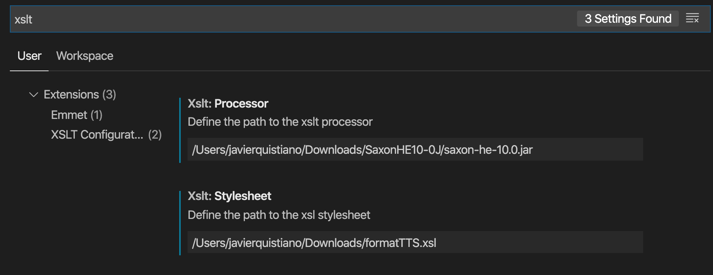

# Rex visualizer — A Webview API extension that converts xml to html using xsl and displays the result

- A static representation of the contente of the XML .rex file
- The xsl stylesheet is defined as a parameter of the extension. You can use your own style

## Settings

- Add the path to the xlst processor and the xls stylesheet
- `xslt.processor`
- `xslt.stylesheet`

The extension `rex-visualizer` is activated when one the TTS files with extension .rex, .play or .log are open. The view is only displayed for XML files with extension .rex

## To compile and run
- npm install
- npm run compile
- press F5 to launch